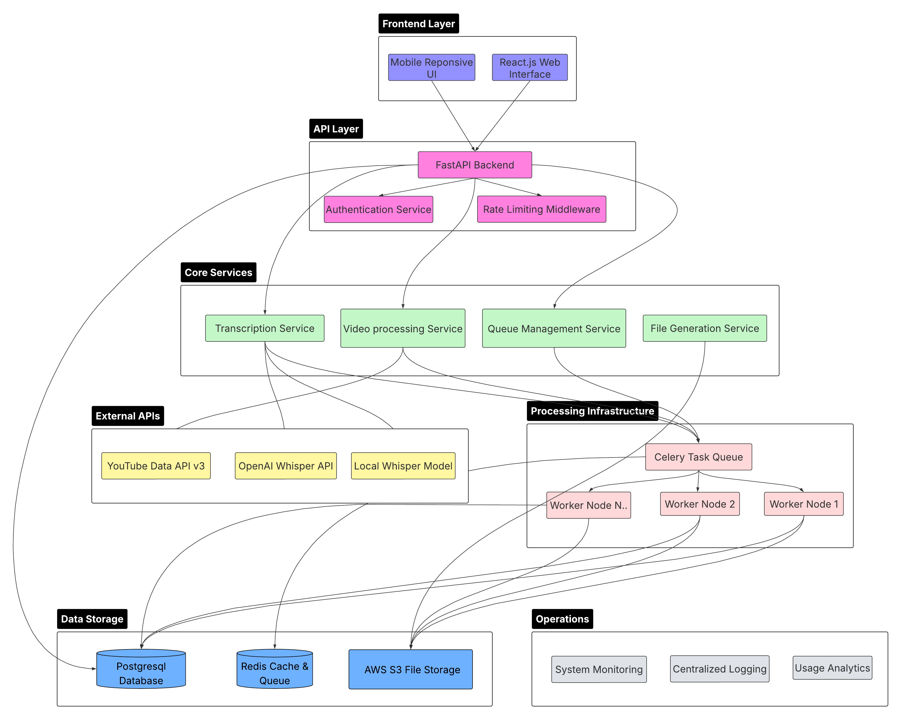

# YouTube Script Generator

A web application that automatically converts YouTube videos into timestamped text scripts using AI-powered speech recognition.
Link project documents: https://docs.google.com/document/d/1YHXbLiU4aYjpT2oGKOlXT6z_E-qyMu-nV_nxR2pVxi4/edit?usp=sharing

## ✨ Features

- 🔗 Simple YouTube URL input
- 🤖 AI-powered transcription with OpenAI Whisper
- ⏱️ Automatic timestamp generation
- 📄 Multiple export formats (TXT, JSON, Excel)
- 📱 Mobile-responsive interface
- ⚡ Real-time processing updates

## 🏗️ System Architecture



The application uses a microservices architecture with:

- **Frontend**: React.js with responsive design
- **Backend**: FastAPI with async processing
- **Processing**: Celery workers for video transcription
- **Storage**: PostgreSQL, Redis, and AWS S3
- **External APIs**: YouTube Data API and OpenAI Whisper

## 🛠️ Tech Stack

**Backend**: Python, FastAPI, Celery, SQLAlchemy, yt-dlp, OpenAI Whisper  
**Frontend**: React.js, Tailwind CSS  
**Database**: PostgreSQL, Redis  
**Storage**: AWS S3  
**Infrastructure**: Docker, Nginx

## 🚀 Quick Start

```bash
# Clone repository
git clone https://github.com/yourusername/youtube-script-generator.git

# Backend setup
pip install -r requirements.txt
uvicorn app.main:app --reload

# Frontend setup
cd frontend && npm install && npm start

# Start workers
celery -A app.celery worker --loglevel=info
```

## 🎯 Usage

1. Enter YouTube URL
2. Click "Generate Script"
3. Monitor real-time progress
4. Download formatted transcript

## 📝 Output Format

```
[00:00 - 00:05]: Hello welcome to my videos
[00:06 - 00:10]: Let's have a look at the overview of what we gonna talk about today
```

## 🤝 Contributing

Fork the repo, create a feature branch, and submit a pull request.

## 📄 License

MIT License

---

Made with ❤️ for content creators and accessibility
